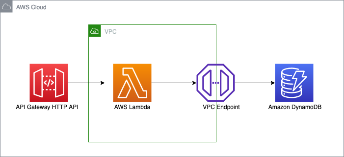

# DevOps Engineer Test


## Overview

My choice was to use [AWS Cloud Development Kit](https://docs.aws.amazon.com/cdk/v2/guide/home.html) that automatically creates an [AWS Lambda](https://aws.amazon.com/lambda/) function writing to [Amazon DynamoDB](https://aws.amazon.com/dynamodb/) and reading from it, invoked by [Amazon API Gateway](https://aws.amazon.com/api-gateway/).



## Setup

The following steps are for Linux.

Install [Node.js](https://nodejs.org/en/download/package-manager). Used version v20.15.1 LTS.

Install [AWS CLI](https://docs.aws.amazon.com/cli/latest/userguide/getting-started-install.html) and [configure](https://docs.aws.amazon.com/cli/latest/userguide/cli-configure-files.html) so that sufficient permissions granted for the AWS resources to be created.

Create a virtualenv for python:

```
$ python3 -m venv .venv
```

Activate the virtualenv:

```
$ source .venv/bin/activate
```

Install the required dependencies:

```
$ pip install -r requirements.txt
```

Install the AWS CDK Toolkit package:

```
$ npm install -g aws-cdk
```

At this point the CloudFormation template can be synthesized for this code (optional):

```
$ cdk synth
```

Bootstrap the CDK environment:

```
$ cdk bootstrap
```

## Deploy

Deploy the stack into AWS:

Using the default profile

```
$ cdk deploy
```

With a specific profile

```
$ cdk deploy --profile test
```

## After deploy

We can send HTTP PUT requests with a JSON object:

PUT /hello/\<username\> { "dateOfBirth": "YYYY-MM-DD" }

```json
{
    "dateOfBirth": "YYYY-MM-DD"
}
```

Testing PUT and GET methods the API can handle:

```
$ curl -w "\nresponse_code: %{response_code}\n" -X "PUT" -H "Content-Type: application/json" -d "{\"dateOfBirth\": \"2001-07-20\"}" https://36n2rdaxub.execute-api.us-east-1.amazonaws.com/hello/userone

response_code: 204

$ curl -w "\nresponse_code: %{response_code}\n" https://36n2rdaxub.execute-api.us-east-1.amazonaws.com/hello/userone
{"message": "Hello, userone! Your birthday is in 5 day(s)"}

response_code: 200
$
```

## Cleanup

Run the command below to delete AWS resources created by this stack:

```
$ cdk destroy
```

## Useful commands

 * `cdk ls`          list all stacks in the app
 * `cdk synth`       emits the synthesized CloudFormation template
 * `cdk deploy`      deploy this stack to your default AWS account/region
 * `cdk diff`        compare deployed stack with current state
 * `cdk docs`        open CDK documentation
